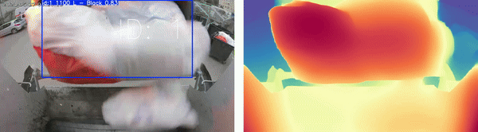
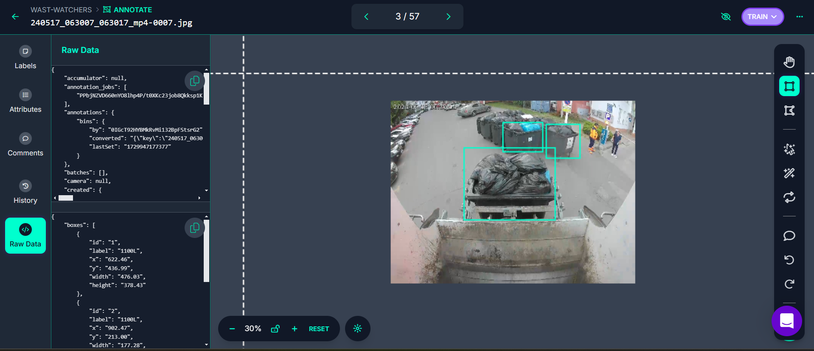
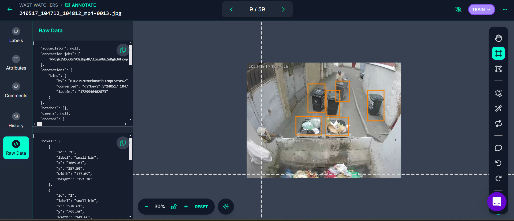
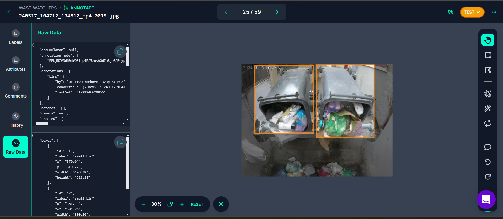
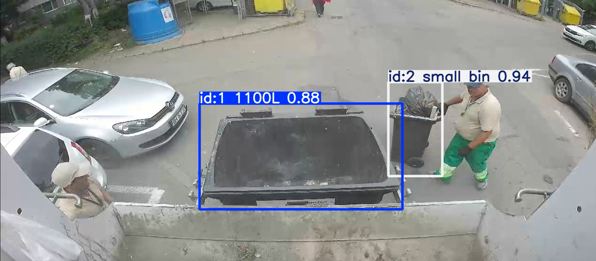
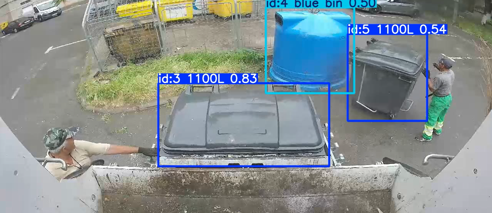

# Installation

Download the `Depth-Anything-V2-Small` model from (here)[https://github.com/DepthAnything/Depth-Anything-V2?tab=readme-ov-file#pre-trained-models]. 
Create checkpoints folder in root of the project and paste checkpoint there. 
Paste YOLO model checkpoints in the `checkpoints/` folder as well.


To install Depth-Anything-V2 package:
```sh
cd third_party/Depth-Anything-V2
pip install -e .
```

# Run

Run the `depth_tracking.py` script.

<br><hr><br>

# The Waste Watchers

## A bit of background

We are a group of five tech enthusiasts brought together by our shared curiosity and drive to explore the world of AI. Three of us are locals from Oradea, while two members joined us from Bucharest, making this their first time in the city. Our team combines diverse skill sets: we have three backend developers, one full-stack developer, and one AI Ph.D. student. Although most of our experience with AI was previously limited to user applications, this project challenged us to dive into the technical depths of AI development for the first time. With minimal AI experience, we embraced this as a learning journey, and it has been an exciting step toward expanding our expertise.

# The Challenge

## AI-Driven Waste Collection Tracking for Smart Cities by CargoTrack

Challenge: Using a provided dataset of videos from real-world waste collection operations, participants are tasked with developing an AI-based solution to automatically detect and count the number of bins collected. The AI system should be able to analyze the videos, identify different types of waste bins, and accurately track each bin as it’s handled by waste collection vehicles.

[Details and Requirements](https://drive.google.com/file/d/18xBsGDdab9emjsYfdxEmSoyn4cir1C1j/view?usp=drive_link)

# The Tries, Iterations, and Approaches

## 1. YOLO v8 nano combined with Kalman filters
### Approach: 
- Approach was to use the YOLO v8 nano model as it is a lightweight model that can be used for real-time object detection.
- Kalman filters were used to track the objects as they were detected.
### Challenges: 
- Lost track easily of objects as it was not a pretrained model for this specific task
- Filters needed to be adjusted frequently based on different scenarios
### Next Iteration:
- Try to use a pretrained model for this specific task provided with the challenge

## 2. YOLO v9 with ByteTrack
### Approach:
- Approach was to use the YOLOv9 model as it is a more recent model that is faster and more accurate than YOLO v8 nano.
- ByteTrack was used as the tracking algorithm as it is a lightweight and accurate tracking algorithm.
### Challenges:
- It was hard to detect bins when they got attached to garbage truck and collected
- Lost track of bins at some points

## 3. YOLO v8 nano combined with ByteTrack_ReID
### Approach: 
- Approach was to use the YOLO v8 nano model as it is a lightweight model that can be used for real-time object detection.
- ByteTrack_ReID was used as the tracking algorithm as it is a more accurate tracking algorithm than ByteTrack and it could handle bins that leave the scene and come back.
### Challenges: 
- We had issues with setting up ByteTrack_ReID, dependencies were not compatible with each other and after taking in consideration the time left for the challenge we decided to abandon this approach.

## 4. SAM (Segment Anything Model)
### Approach: 
- Approach was to use the SAM model as it is a model that can be used for real-time object detection and it could handle bins that leave the scene and come back.
### Challenges: 
- The SAM model worked partially, it was able to detect the bins and track them but it lost track of the main object and tagged everything as bins.

## 5. Depth-Anything-V2 with Depth-Consistency Tracking

### Approach:

- We used the Depth-Anything-V2 model to estimate depth from single frames, aiming to enforce depth-consistency across time. Depth information was integrated as a tracking heuristic, alongside the x and y coordinates of each bounding box in Kalman Filtering.
- This approach allowed us to address the problem of bins losing their IDs when coming very close to the camera, as depth information helped maintain consistent identification.

### Challenges:

- While depth integration reduced ID loss when bins approached the camera, it introduced some instability in other scenarios, leading to ID mixing among dumpsters.
- Given more time, we would have refined this approach by adding the depth (z-component) into the Kalman Filter to achieve smoother and more accurate tracking results.




# The Solution


To overcome the challenges faced in previous approaches, we implemented a refined solution with the following steps, supported by a pretrained model received as part of the challenge resources:

## 1. Dataset Creation for Fine-Tuning

**Objective:** Collect and curate a specialized dataset focused on waste bins to improve detection accuracy.

**Process:** Extracted frames from the provided videos, manually labeled the waste bins, and expanded the dataset with varied scenarios to cover diverse environmental conditions.

**Outcome:** This custom dataset allowed for targeted training, helping the model to distinguish bins even when they were attached to or obstructed by the collection truck.

## Bin Detection Examples





## 2. Model Selection and Fine-Tuning with Ultralytics YOLO

**Objective:** Leverage YOLO’s robust object detection capabilities, with further customization through Ultralytics for better bin detection.

**Process:** Using YOLO’s fine-tuning capabilities on the new dataset, the model was optimized to prioritize bin identification and tracking, reducing false detections.

**Outcome:** Fine-tuning with Ultralytics improved detection speed and accuracy, making the model reliable in real-time applications within the waste collection context.

## 3. Enhanced Heuristics for Improved Tracking and Counting

**Objective:** Develop heuristics to handle edge cases, such as bins being momentarily obscured or leaving and re-entering the frame.

**Process:** Implemented heuristics that incorporate spatial and temporal information to maintain bin count accuracy, even as bins interact with the collection vehicle.

**Outcome:** Enhanced heuristics significantly improved tracking continuity, reduced re-identification issues, and achieved reliable bin counting throughout each video sequence.

## Tracking in Progress



This structured solution approach helped us achieve a more stable and accurate detection and tracking of waste bins, effectively meeting the project’s objectives for smart waste management.
